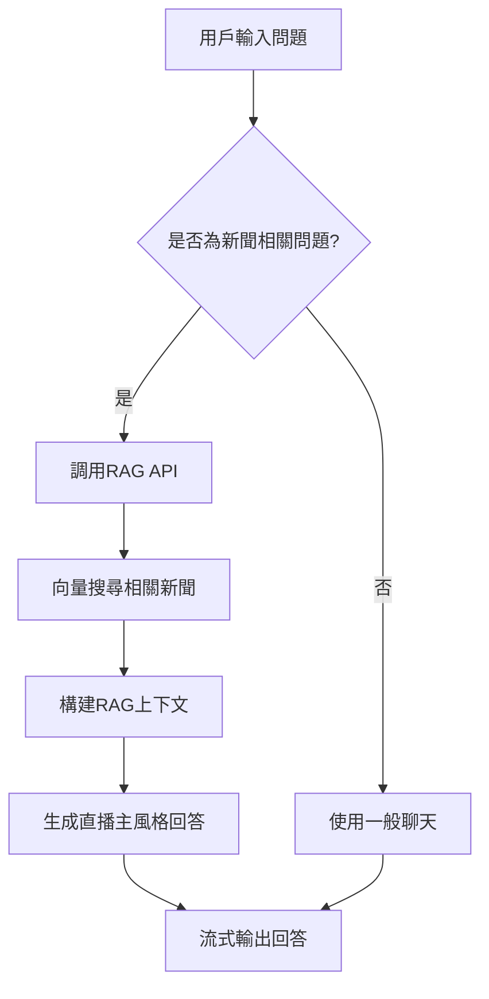

# 🎙️ RAG整合功能使用指南

## 📋 功能概述

本功能將RAG（檢索增強生成）技術整合到AITuber的聊天功能中，當用戶詢問新聞相關問題時，系統會自動：

1. **自動檢測**：識別用戶問題是否與新聞相關
2. **智能檢索**：從向量資料庫中搜尋相關新聞資料
3. **增強回答**：使用檢索到的新聞資料生成更準確的回答
4. **直播主風格**：以活潑的直播主風格呈現新聞內容

## 🚀 快速開始

### 1. 確保服務運行

在 **VSCode PowerShell 終端** 中執行以下指令：

```powershell
# 檢查Docker容器狀態
docker-compose ps

# 如果服務未運行，啟動所有服務
docker-compose up -d
```

### 2. 測試RAG整合功能

在瀏覽器中訪問測試頁面：
```
http://localhost:3000/test-rag-integration.html
```

### 3. 在主應用中測試

訪問主應用首頁：
```
http://localhost:3000
```

在聊天框中輸入新聞相關問題，例如：
- "最近有什麼新聞？"
- "今天台灣發生了什麼事？"
- "日本有什麼最新消息？"

## 🔧 技術架構

### 核心組件

1. **RAG整合服務** (`src/lib/rag/ragIntegration.ts`)
   - 新聞問題檢測
   - RAG API調用
   - 回答整合

2. **聊天處理器修改** (`src/features/chat/vercelAIChat.ts`)
   - 自動RAG檢測
   - 流式回答處理
   - 錯誤處理

3. **RAG API** (`src/pages/api/rag/chat.ts`)
   - 向量搜尋
   - 上下文構建
   - 直播主風格回答

### 工作流程



## 📰 支援的新聞類型

### 關鍵詞檢測
系統會自動檢測包含以下關鍵詞的問題：

**中文關鍵詞**：
- 時間相關：新聞、最新、最近、今天、昨天、明天
- 事件相關：發生、事件、消息、報導、頭條、熱門
- 地區相關：台灣、日本、國際
- 主題相關：科技、政治、經濟、社會、文化、體育
- 具體領域：天氣、地震、颱風、疫情、選舉、政策等

**英文關鍵詞**：
- news, latest, recent, today, yesterday, tomorrow
- breaking, urgent, important, headline, report
- taiwan, japan, international, technology, politics

### 問句模式檢測
支援以下問句模式：
- "最近有什麼新聞？"
- "今天台灣發生了什麼事？"
- "科技新聞有什麼新發展？"
- "天氣如何？"

## 🎯 使用場景

### 1. 新聞播報
```
用戶：最近有什麼新聞？
AI：大家好！讓我來為各位觀眾分享最新的新聞動態...
```

### 2. 特定事件查詢
```
用戶：今天台灣發生了什麼事？
AI：各位觀眾，今天台灣確實有一些重要的事件發生...
```

### 3. 國際新聞
```
用戶：日本有什麼最新消息？
AI：哈囉！關於日本的最新消息，我來為大家整理一下...
```

## 🔍 測試功能

### 測試頁面功能

1. **新聞問題測試**
   - 輸入新聞相關問題
   - 查看是否觸發RAG功能
   - 檢查回答品質

2. **RAG功能測試**
   - 直接測試RAG搜尋
   - 測試RAG聊天功能
   - 檢查搜尋結果

3. **系統狀態檢查**
   - 檢查RAG API狀態
   - 檢查聊天API狀態
   - 檢查新聞API狀態

### 測試指令

在 **VSCode PowerShell 終端** 中執行：

```powershell
# 測試RAG搜尋功能
curl -X POST http://localhost:3000/api/rag/search \
  -H "Content-Type: application/json" \
  -d '{"query":"台灣新聞","collection":"news_knowledge","limit":3}'

# 測試RAG聊天功能
curl -X POST http://localhost:3000/api/rag/chat \
  -H "Content-Type: application/json" \
  -d '{"messages":[{"role":"user","content":"最近有什麼新聞？"}],"ragEnabled":true}'
```

## ⚙️ 配置選項

### 環境變數
```bash
# ChromaDB設定
CHROMA_URL=http://chromadb:8000

# Ollama設定
OLLAMA_BASE_URL=http://ollama:11434
OLLAMA_EMBEDDING_MODEL=jeffh/intfloat-multilingual-e5-large-instruct:f16

# 新聞集合名稱
NEWS_COLLECTION=news_knowledge
```

### 調整參數
在 `src/lib/rag/ragIntegration.ts` 中可以調整：

```typescript
// 搜尋結果數量
searchLimit: 3

// 模型設定
model: 'gpt-oss:20b'
temperature: 0.7
maxTokens: 4096
```

## 🐛 故障排除

### 常見問題

1. **RAG功能未觸發**
   - 檢查問題是否包含新聞關鍵詞
   - 確認向量資料庫中有新聞資料
   - 檢查API連線狀態

2. **搜尋結果為空**
   - 確認新聞資料已成功匯入
   - 檢查embedding模型是否正常
   - 驗證ChromaDB連線

3. **回答品質不佳**
   - 調整搜尋結果數量
   - 修改系統提示詞
   - 檢查新聞資料品質

### 除錯指令

在 **VSCode PowerShell 終端** 中執行：

```powershell
# 檢查ChromaDB狀態
docker logs chromadb

# 檢查Ollama狀態
docker logs ollama

# 檢查應用程式日誌
docker logs app
```

## 📈 效能優化

### 建議設定

1. **搜尋優化**
   - 適當的搜尋結果數量（3-5條）
   - 優質的embedding模型
   - 定期清理舊新聞資料

2. **回答優化**
   - 調整溫度參數
   - 優化系統提示詞
   - 監控回答品質

## 🔄 更新維護

### 新聞資料更新
系統會透過n8n工作流程自動更新新聞資料：

1. **RSS抓取**：每小時抓取最新新聞
2. **資料處理**：清理和格式化新聞內容
3. **向量化**：生成embedding並存入ChromaDB
4. **品質檢查**：驗證資料完整性

### 手動更新
在 **VSCode PowerShell 終端** 中執行：

```powershell
# 手動觸發新聞更新
curl -X POST http://localhost:3000/api/news/fetch
```

## 📞 支援

如有問題，請檢查：
1. 系統狀態檢查頁面
2. 應用程式日誌
3. Docker容器狀態
4. API連線狀態

---

**注意**：所有指令都應在 **VSCode PowerShell 終端** 中執行，確保在正確的執行環境中操作。
